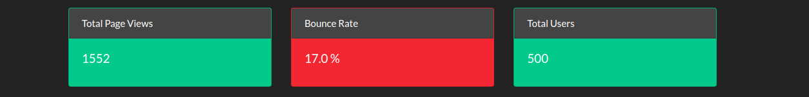
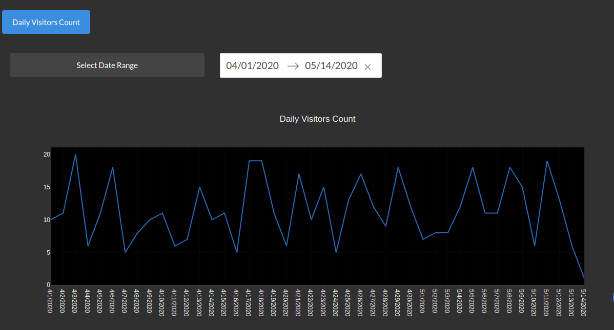
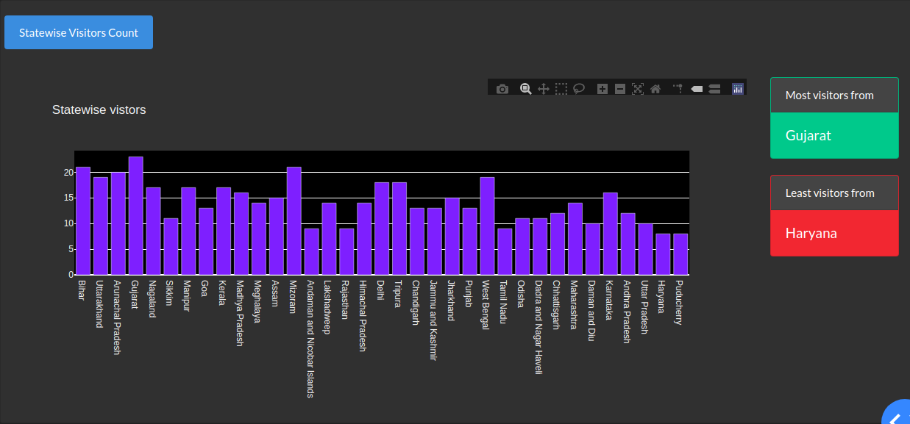
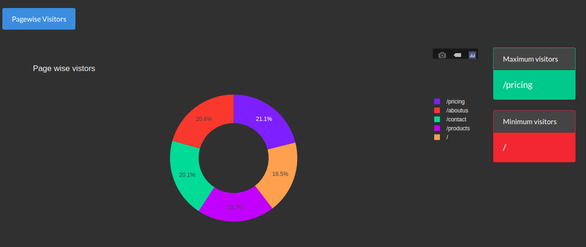

# web-analytics-dashboard

## How to test on local machine

### download the repository and unzip
### cd to the unzipped repo
### pip3 install -r requirements.txt
### python3 app.py
### go to http://127.0.0.1:8050/

#

## Metrics

## Datewise Visitors

## Statewise Visitors

## Pagewise Visitors

## Citywise Visitors

